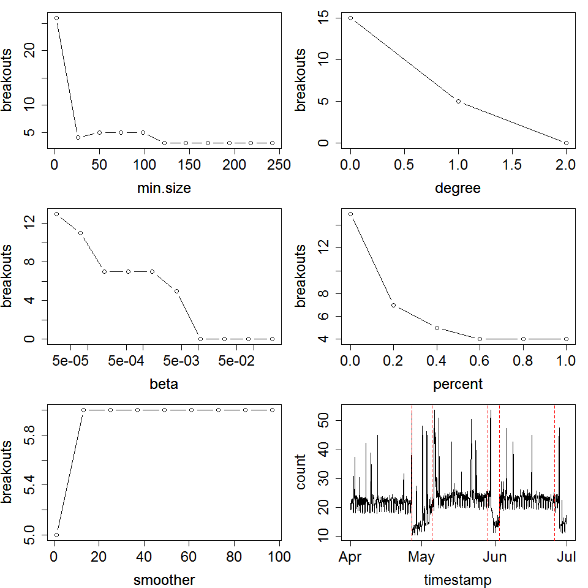
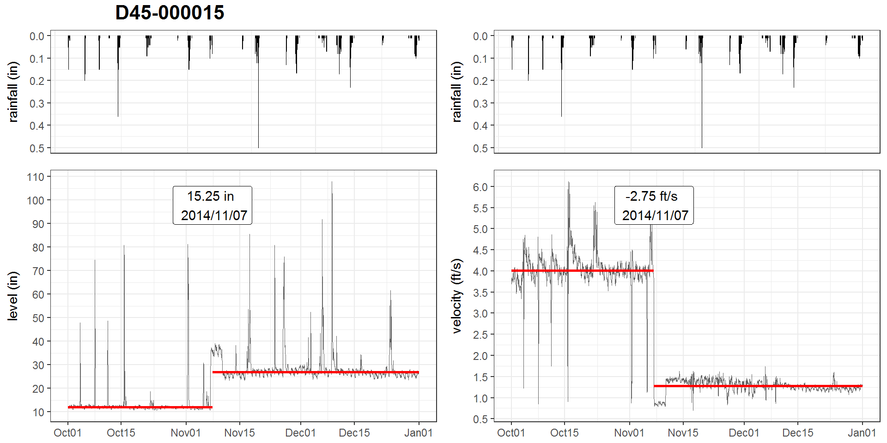
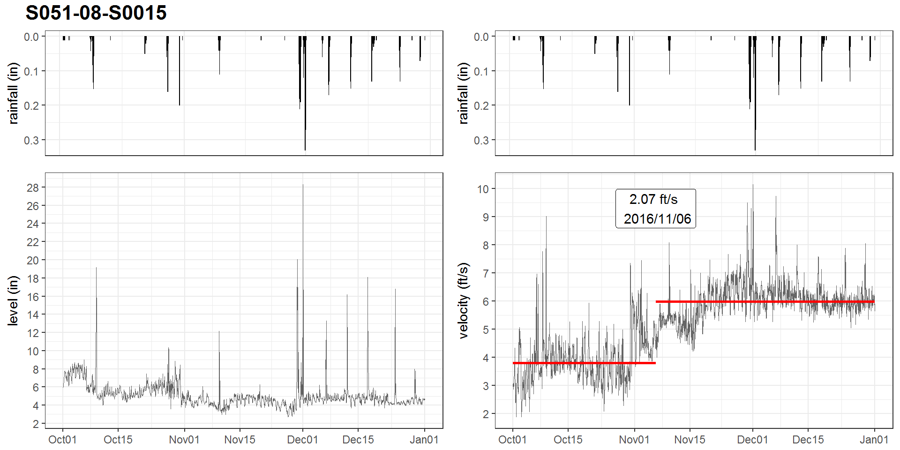
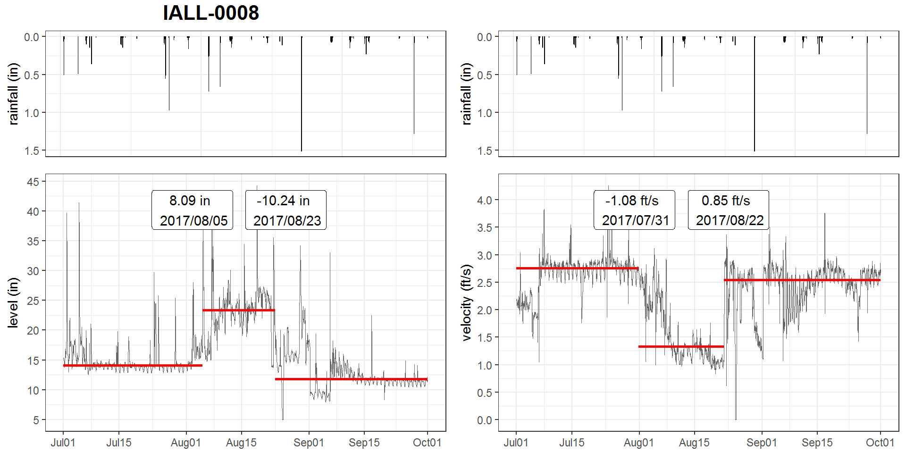
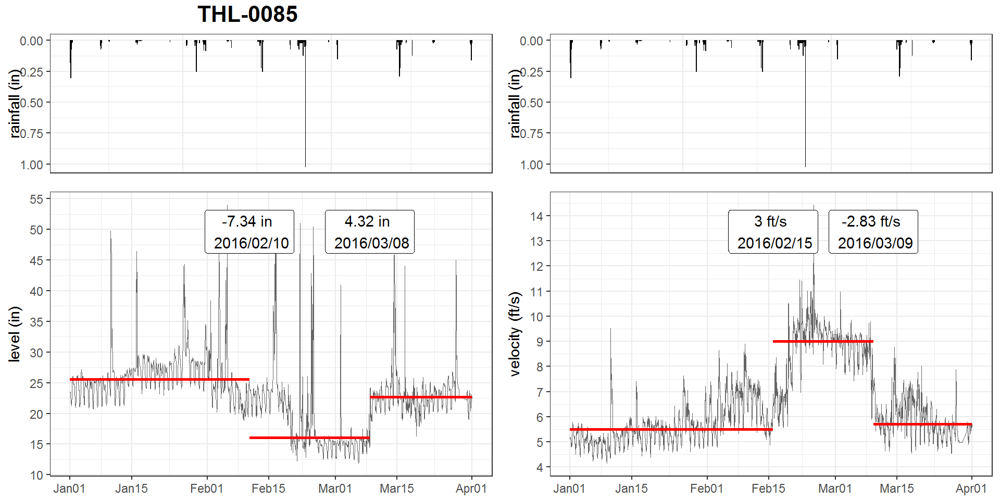
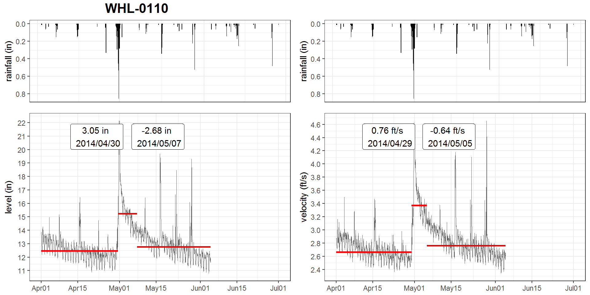

<h3>ABSTRACT</h3>

The Philadelphia water department (PWD) has been actively monitoring flow data at over 400 sites over Philadelphia since the 2000s. Data is collected twice a month through contractors. Due to the high solid content in sewage, flow data at sewer pipes (level, velocity) suffered from breakouts (mean shift, ramp up) over the time due to sensor ragging, pipe clogging, etc. A stringent Quality Control (QC) protocol is conducted before the data can be used for Hydrologic & Hydraulic modeling tasks. As one QC measure, the water level and velocity are examined to detect any potential breakout. 

Since flow data fluctuates with rainfall-runoff events, the breakout detection algorithm must be robust to avoid the interference of runoff responses. Several breakout detection techniques were compared, and the E-Divisive with Medians (EDM) algorithm is adopted in this study. EDM recursively partitions a time series and uses a permutation test to determine change points. The EDM has following advantages: 
1. EDM uses moving median as opposed to the mean, which is robust to the presence of anomalies; 
2. EDM can detect both 'mean shift' (sudden change) and 'ramping' (gradual change) for multiple change points; 
3. EDM takes a non-parametric approach, meaning the model will adapt to the data's underlying distribution, and therefore can detect distribution change;
4. EDM is fast, as it uses interval trees to efficiently approximate the median. 

The analysis is implemented in a program written in R, and the EDM algorithm is implemented via the 'BreakoutDetection' package developed by Twitter engineers. Non-trivial parameters of the EDM model are carefully tuned to best match the expected outcome. This analysis provides an additional assurance to the data quality. Also, field crews (monitoring, Operation & Maintenance, etc.) can quickly respond to the issue once a breakout has been detected. This analysis is also applicable for other monitored data, such as the trunk and outfall levels at drainage system regulators.

### 1  BACKGROUND

The Philadelphia Water Department (PWD) maintains hydrologic and hydraulic models of the combined sewer collection system for planning, management and compliance purposes. PWD relies on these models to evaluate the effectiveness of existing and proposed CSO control measures. Efforts are being made to refine the models and improve their accuracy as the program progresses from planning to implementation phases. Since the 2000s, PWD has been monitoring the sewerage level and velocity at over 400 manholes across the city for various model calibration/validation tasks. Data are measured at 15-minute interval, which are collected bi-weekly by contractor.

Figure 1. Map of Philadelphia, showing the combined sewer H&H Model, and flow monitoring sites used for model calibration/validation

Due to the high solid content in sewage, level and velocity measurements at sewer pipes may suffered from breakouts (mean shift, ramp up) over the time due to sensor ragging, clogging, or pipe surcharging, etc. A stringent Quality Control (QC) protocol is conducted before the data can be used for Hydrologic & Hydraulic modeling tasks. As one QC measure, the water level and velocity data are examined to detect potential breakouts. Since a breakout isn’t always obvious in time-series plots, visually identifying breakouts is not sufficient and efficient. Hence, a statistical approach that can automatically detect breakouts in a time-series is imperative. 

Since flow data at both combined and sanitary sewer pipes has runoff/RDII components, it may interfere the breakout detection. Therefore, the algorithm must be robust against the presence of anomalies.

### 2  OBJECTIVES

Data quality determines the overall model quality. This study aims to develop a workflow for detecting breakouts in flow monitoring data (level and velocity) utilizing a sound statistical techniques. First, Several state-of-art breakout detection methods are compared through literature review and sample test, and the one that met the following requirements is selected:

-   robust against the presence of anomalies

-   able to detect various types of change (mean, variance, distribution)

-   able to detect multiple breakouts 

-   weak or no assumption on data distribution

-   fast on large data-sets, produce reliable results 

Then the algorithm parameters are carefully tuned to optimize the outcome.

Finally, an application is developed in the R statistical programming language for the breakout detection analysis. A quarterly report is also generated by the application, which is automatically updated biweekly when new data becomes available.

### 3  METHODOLOGY
#### 3.1  Change point analysis

In statistics, the 'breakout detection' belongs to the change point analysis, which has been widely researched over the past 50 years in a wide variety of fields (Rodionov 2005), such as finance (Edwards et al 2012), genetics (Chen and Gupta 2011), and signal processing (Basseville 1988). As we've entered the 'Big Data' era, it has gain it's popularity in low latency, high reliability online analytics for cloud data (James et al 2016).

A breakout is typically characterized by two steady states and an intermediate transition period. Mathematically, for data z1,…,zn, if a changepoint exists at τ, then z1,…,zτ differ from zτ+1,…,zn in some way. There are many different types of change, such as mean shift, which is a sudden jump in the time series; Ramp up/down, which is a gradual change in the value of the metric from one steady state to another; distribution change, which is a change in the data distribution. 

Change point analysis mainly answers the questions regarding the existence of a change point, the location of the change, and its significance. Depending on the data distribution assumption, a breakout detection algorithm generally falls into two categories: parameteric (assumes that the observed distributions belong to a family of distributions) and non-parametric (do not make assumption on data distribution and density estimation is used instead) (Pohlert 2018). While parametric methods may be more efficient, most time-series doesn't follow a known distribution family, and therefore, non-parametric methods is preferred.  

Based on the application, breakout detection analysis can be classified as either online (the data is continuously feed to the model) or offline (the data are processed in batches). In this study, an offline analytics is performed since the data is acquired biweekly.  

Although Numerous changepoint detection algorithms are available, many of which are limited to the flow monitoring data as they are not robust against anomalies. 

####  3.2  E-divisive with medians (EDM)

EDM is a novel statistical technique that employs energy statistics (E-divisive) to detect divergence of means. Energy statistics compares the distances of means of two random variables contained within a larger time series. The E-divisive method recursively partitions a time series and uses a permutation test to determine change points, but it is computationally intensive. To overcome this, EDM uses interval trees to efficiently approximate the median, and therefore is much faster than E-Divisive.

EDM can detect various types of change, including 'mean shift' (sudden change), 'ramping' (gradual change), and change in distributions. since EDM is non-parametric, it doesn't make any assumption about the distribution of the time-series, instead, it learn the current distribution as a reference. When the distribution suddenly change EDM can detect the variation; In addition, EDM is capable of detecting multiple change points. To be robust against the presence of anomalies, EDM uses the rolling median as a local smoother to the raw data.

A comparison (James, et al. 2016) between EDM and Pruned Exact Linear Time (PELT) method (Killick et al, 2012), a parametric method for change point detection, shows that EDM outperformed the PELT in the majority of data sets. Due to the weaker assumption in EDM, the EDM takes longer to execute than the PELT. However, the EDM has shown a comparable or better efficacy. Overall, EDM is 3.5x faster than PELT.

####  3.3  R packages for breakout detection

Several R packages can perform breakout detection, such as the `changepoint` package implements the PELT and ... method (Killick & Eckley, 2014), the `ecp` package implements the E-divisive and E-agglometric methods (Matteson & James 2012), and the `BreakoutDetection` package implements the EDM method (James, et al. 2016). The package is developed by Twitter engineers and has been used for analyzing network breakouts on a daily basis at Twitter Inc.

The `breakout()` is the detector function, including several arguments that specify the cost and penalty. The `method` specifies if a single or multiple breakouts is desired. The `min.size` specifies the minimum number of observations between change points. larger value stands for longer distance between breakouts and thus less breakouts. The value generally ranges from 60 to 240, and it should also be subject to the data analyst's experience on the occurence frequency of breakouts. Improperly setting the value may result in too many or too few breakouts. The `degree` specifies the degree of the penalization polynomial (for false positive), the value can only be 0, 1, or 2, and larger value tends to detect fewer breakouts. Sz&egrave;kely & Rizzo (2005) claims that for detecting divergence in mean, degree is set to 2; for detecting arbitrary change in distribution, 0 < `degree` < 2 may be a better choice. The `beta` and `percent` specify the amount of penalization (for false positive). The `beta` generally ranges from 10^-5^ to 10^-2^, where larger value tends to detect less breakouts. The `percent` represents the minimum percent change in the goodness of fit statistic to consider adding an additional change point, which generally ranges from 0.1 to 0.6, and larger value tends to detect less breakouts. Note that when `beta` is specified, `percent` is skipped.

####  3.4 breakout() argument refinement

Arguments of the `breakout()` function significantly affect the outcome, i.e., the count and location of breakouts. To improve the result, the arguments are refined through a series of supervised trials based on multiple independent flow monitoring time-series, each contains 3 months of hourly level or velocity measurements. The `method` argument is fixed to 'multi' as it's desired for this analysis. 

The training process is implemented via a R script. Default values were set for `min.size`, `degree`, `beta`, `percent` arguments in the 'input' section. Since EDM only uses the nearest neighbors for smoothing, an additional rolling median filter is applied to data before analyzed by the detector function, and the argument `smoother` is also discussed, which represents the width of window for the rolling median. 

For each argument, the value of the specific argument is varied by a series of values while keeping the rest constant (default value), and the count of breakouts detected is plotted against the value of the argument, which is called the 'elbow plot' as shown in Figure 2. The elbow plot demonstrates the sensitivity of an argument under a single-variable condition, and gives indication on the proper range of the argument (near the 'elbow'), which is helpful for setting value for the next trial. Based on the results, a new set of argument values is proposed, and the process is repeated until the desired outcome is met. 

Figure 2 An example of elbow plots used in the process of argument refinement

### RESULTS

After literature review and sample tests, the E-Divisive with Medians (EDM) algorithm is adopted in this study because of its robustness against anomalies and weak assumption on the data distribution. The detector function arguments are carefully tuned through a series of trials,and the results are summarized in table 1.  

Table 1  Summary of value for `breakout()` arguments 

argument | level | velocity
---------|-------|----------
min.size |  120  | 120
degree   |   1   |  1 
beta     | 0.002 | 0.008 
percent  |  NA   |  NA

The `min.size` is set to 120 for both parameter, which stands for 5 days of duration. The `degree` is set to 1 as it's sufficient to detect both mean shift and distribution changes. The `beta` is larger for velocity than level because velocity is relatively less stable, and a more stringent penalty is hereby needed to avoid "overkill" for breakout detection.  The `percent` is not applicable as `beta` has already been specified. The `smoother` is not used as it tends to generate more breakouts, which may be useful for detecting breakouts in time-series with heavy noise.

The breakout detection process is implemented in a R script. To improve the performance, multi-thread parallel computation is utilized where multiple time-series are examined simultaneously. 

A R markdown document is developed that executes the breakout detection script, and generates a quarterly report that include a summary of the results, and hydrograph-hyetograph for all sites with breakouts information overlaid.  The report is automatically updated bi-weekly when new data is uploaded. In the future, it's expected to be updated more frequently when real-time data becomes available. 

A few breakout examples are shown in Figure 3 to Figure 6. 

Figure 3 and 4 demonstrate the 'mean shift' (sudden change) and 'ramping' (gradual change) types of breakouts detected by the EDM method. In Figure 3, a breakout is detected near November 11, 2014. In Figure 4, a breakout is detected near 

Figure 3. breakout detection for LFLL-0015 for the period of Q2, 2015

Figure 4. breakout detection for S051-08-S0015 for the period of Q4, 2016

Figure 5 shows two breakouts near August 1, 2017 and August 22, 2017 for both level and velocity, where the level for temporarily elevated and the velocity decreased. This is likely caused by pipe clogging that reduced the cross-sectional area of the pipe. Figure 6 shows an opposite pattern, which could be related to the flushing and resettlement of silts during the period.  

Figure 5. breakout detection for IALL-0008 for the period of Q3, 2017

Figure 6. breakout detection for THL-0085 for the period of Q1, 2016

There are two limitations for this method. First, due to the non-parametric natural of this method, breakouts at both ends of the time-series cannot be detected (e.g., as shown at the beginning of Figure 5), which can be solved by extending the range of the data. Second, large runoff events may be identified as breakouts (as shown in Figure 7) as the EDM only calculates the rolling median with the nearest neighbors. Therefore, an additional smoother may be imperative. 

Figure 7. breakout detection for WHL-0110 for the period of Q2, 2014

### CONCLUSIONS
 
E-divisive with Median (EDM) is proven to be a reliable, effective, and efficient breakout detection technique that has been adopted by Twitter Inc. for cloud data. In this study, An application of EDM for detecting breakouts in flow monitoring data was explored and has received satisfactory results. A workflow has been established via R scripts and R markdown documents. This application provides Quality Control(QC) to the modeling data, which would be beneficial for improving the model quality and is also helpful for quick response to field issues. With properly tuned parameters, this method is expected to be applicable for other monitored time-series data, such as trunk and outfall levels in combined sewer drainage system.

### REFERENCE

James, Nicholas A., Kejariwal, Arun, and Matteson, David S. 2016."Leveraging cloud data to mitigate user experience from ‘Breaking Bad’: The Twitter Approach." *2016 IEEE International Conference on Big Data* 3499-3508.

Matteson, David S., and James, Nicholas A. 2014. "A non-parametric approach for multiple change point analysis of multivariate data." *Journal of the American Statistical Association* 109(505): 334-345.

James, Nicholas A., and David S. Matteson. 2013. "ecp: An R package for non-parametric multiple change point analysis of multivariate data." arXiv:1309.3295.

Edwards, Robert D., Magee, John, and Bassetti, W.H.C. 2012. "Technical analysis of stock trends." CRC Press.

Chen, J. and Gupta, Arjun K. 2011. "Parametric Statistical Change Point Analysis: With Applications to Genetics, Medicine, and Finance." Springer.

Basseville, Mich&egrave;le 1988. "Detecting changes in signals and systems survey." *Automatica*, 24(3):309–326.

Killick, Rebecca, and Eckley, Idris 2014. "changepoint: An R package for changepoint analysis." *Journal of statistical software* 58(3): 1-19.

Rebecca Killick, Paul Fearnhead, and IA Eckley 2012. "Optimal detection of changepoints with a linear computational cost." *Journal of the American Statistical Association*, 107(500):1590–1598.

Rodionov, S. N. 2005. "A brief overview of the regime shift detection methods." *Large-scale disturbances (regime shifts) and recovery in aquatic ecosystems: challenges for management toward sustainability* 17-24.

Pohlert, Thorsten. 2018. "Non-parametric trend tests and change-point detection." CC BY-ND 4.

Sz&egrave;kely, G. J. and Rizzo, M. L. 2005. "Hierarchical clustering via joint between-within distances: Extending ward’s minimum variance method."
*Journal of classification* 22(2):151–183.

### Author Affiliations
Hao Zhang, Ph.D., Philadelphia Water Department, Philadelphia, PA.
