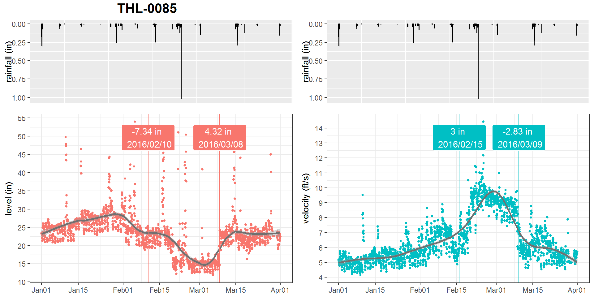

### ABSTRACT

The Philadelphia water department (PWD) has been actively monitoring flow data at over 400 sites over Philadelphia since the 2000s. Data is collected twice a month through contractors. Due to the high solid content in sewage, flow data at sewer pipes (level, velocity) suffered from breakouts (mean shift, ramp up) over the time caused by sensor ragging, pipe clogging, etc. A stringent Quality Control (QC) protocol is conducted before the data can be used for Hydrologic & Hydraulic modeling tasks. As one QC measure, the water level and velocity are examined to detect any potential breakout. 

Since flow data fluctuates with rainfall-runoff events, the breakout detection algorithm must be robust to avoid the interference of runoff responses. Several breakout detection techniques were compared, and the E-Divisive with Medians (EDM) algorithm is adopted in this study. EDM recursively partitions a time series and uses a permutation test to determine change points. The EDM has following advantages: 
1. EDM uses moving median as opposed to the mean, which is robust to the presence of anomalies; 
2. EDM can detect both 'mean shift' (sudden change) and 'ramping' (gradual change) for multiple change points; 
3. EDM takes a non-parametric approach, meaning the model will adapt to the data's underlying distribution, and therefore can detect when distribution changes;
4. EDM is fast, as it uses interval trees to efficiently approximate the median. 

The analysis is implemented in a program written in R, and the EDM algorithm is implemented via the 'breakoutDetection' package developed by Twitter.Inc. Non-trivial parameters of the EDM model are carefully tuned to match the expected outcome. This analysis provides an additional assurance to the data quality. Also, field crews (monitoring, Operation & Maintenance, etc.) can quickly respond to the issue once a breakout has been detected. This analysis is also applicable for other monitored data, such as the trunk and outfall levels at drainage system regulators.

### BACKGROUND

logic: sewerage contain large solid contents -> flow monitoring sensor often get ragged | pipe surcharge -> flow data (CS, SS) influenced by rain events -> robust breakout detection is required -> several change point detection techniques available and applicable in various industries -> method 1 -> method 2 -> method 3

PWD monitors flow data for model calibration. 
-   importance of this research: improve data quality, detect potential sensor malfunction for large datasets (low latency, high reliability)

- change point analysis:
    
    -   answers:
        
        -   does it happen?
        
        -   when did it happen
        
        -   what is the difference?
        
        -   how sure is it?

    -   techniques:
        
        -   parametric vs. non-parametric
        
        -   online vs. offline
    
    -   methods: (focus on EDM)
        
        -   ecp
        
        -   cpm
    
        -   changepoint
        
            -   PELT
            
        -   breakpoint
    
        -   EDM

### OBJECTIVES

-   importance of this research: improve data quality, detect potential sensor malfunction for large datasets (low latency, high reliability) 

-   compare methods, pick a sound breakout detection technique that:
    -   can detect mulitple breakouts 
    -   can detect multiple types of change, e.g., ramping, change in variation, etc 
    -   the data is multivariate time series, often non-normal distributed
    -   data includes interference, e.g. runoff responses 
    -   quick enough for online analysis

-   refine model parameters 

-   create an application that can be triggered automatically 

### METHODS

[Methods comparison] ---very briefly explain the reason of why using EDM

the EDM method adopted in the `reakoutDetection` package is selected in this study. 

parameter refinement: 

-   elbow plot, penalty, ...

-   period: 10 days
...

Implementation:  A R markdown document is developed for generating reports, including a table of detected breakouts, the hyetograph and the hydrograph. 

-   data source

-   multi-threads computation

### RESULTS

The quarterly report is generated bimonthly when new data comes in. It's expected to be completely online when data streaming becomes available. 

As seen, ...

### CONCLUSIONS

The EDM method is proven to be a reliable noval statistics technique to detect breakouts in flow data with low latency.  

A Web application that runs continuously provides an additional data QA, which would be beneficial to the model quality.  

### REFERENCE

James, Nicholas A., Arun Kejariwal, and David S. Matteson. "Leveraging cloud data to mitigate user experience from ‘Breaking Bad’." In Big Data (Big Data), 2016 IEEE International Conference on, pp. 3499-3508. IEEE, 2016.

Matteson, David S., and James, Nicholas A. "A nonparametric approach for multiple change point analysis of multivariate data." Journal of the American Statistical Association 109, no. 505 (2014): 334-345.

James, Nicholas A., and David S. Matteson. "ecp: An R package for nonparametric multiple change point analysis of multivariate data." arXiv preprint arXiv:1309.3295 (2013).
