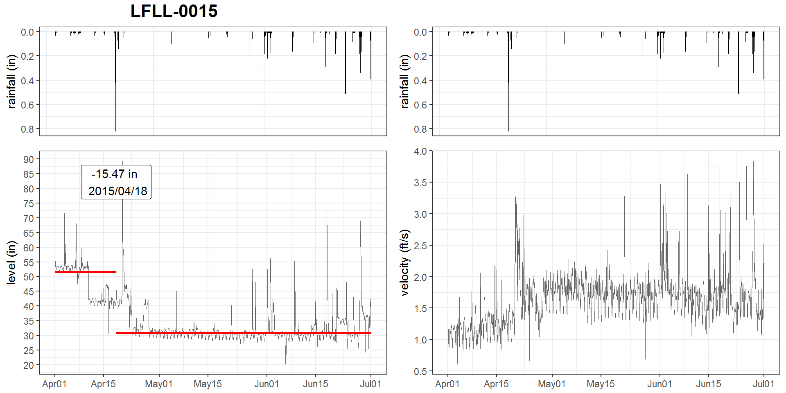

<h3>ABSTRACT</h3>

The Philadelphia water department (PWD) has been actively monitoring flow data at over 400 sites over Philadelphia since the 2000s. Data is collected twice a month through contractors. Due to the high solid content in sewage, flow data at sewer pipes (level, velocity) suffered from breakouts (mean shift, ramp up) over the time caused by sensor ragging, pipe clogging, etc. A stringent Quality Control (QC) protocol is conducted before the data can be used for Hydrologic & Hydraulic modeling tasks. As one QC measure, the water level and velocity are examined to detect any potential breakout. 

Since flow data fluctuates with rainfall-runoff events, the breakout detection algorithm must be robust to avoid the interference of runoff responses. Several breakout detection techniques were compared, and the E-Divisive with Medians (EDM) algorithm is adopted in this study. EDM recursively partitions a time series and uses a permutation test to determine change points. The EDM has following advantages: 
1. EDM uses moving median as opposed to the mean, which is robust to the presence of anomalies; 
2. EDM can detect both 'mean shift' (sudden change) and 'ramping' (gradual change) for multiple change points; 
3. EDM takes a non-parametric approach, meaning the model will adapt to the data's underlying distribution, and therefore can detect when distribution changes;
4. EDM is fast, as it uses interval trees to efficiently approximate the median. 

The analysis is implemented in a program written in R, and the EDM algorithm is implemented via the 'breakoutDetection' package developed by Twitter.Inc. Non-trivial parameters of the EDM model are carefully tuned to match the expected outcome. This analysis provides an additional assurance to the data quality. Also, field crews (monitoring, Operation & Maintenance, etc.) can quickly respond to the issue once a breakout has been detected. This analysis is also applicable for other monitored data, such as the trunk and outfall levels at drainage system regulators.

### 1  BACKGROUND

#### 1.1  Combined and Sanitary Sewer System Model of Philadelphia

The Philadelphia Water Department (PWD) maintains hydrologic and hydraulic models of the combined sewer collection system for planning, management and compliance purposes. PWD relies on these models to evaluate the effectiveness of existing and proposed CSO control measures. Efforts are being made to refine the models and improve their accuracy as the program progresses from planning to implementation phases. PWD has been monitoring the sewerage level and velocity at over 400 manholes all over the city since the 2000s, which are served for various model calibration/validation tasks.  

Due to the high solid content in sewage, flow data at sewer pipes (level, velocity) may suffered from breakouts (mean shift, ramp up) over the time due to sensor ragging, clogging, pipe surcharging, etc. A stringent Quality Control (QC) protocol is conducted before the data can be used for Hydrologic & Hydraulic modeling tasks. As one QC measure, the water level and velocity time-series are examined to detect any potential breakout. Since a breakout isn’t always obvious due to the range of the observed values, visual detection of breakouts may not be sufficient, and thus a programmatic approach that can automatically detect breakouts is imperative. 

Since flow data at sewer pipes fluctuates with rainfall-runoff events, the runoff response may interfere the breakout detection. Therefore, the algorithm must be robust against the presence of anomalies.

### 2  OBJECTIVES

Measurement Accuracy determines the overall model quality. This study aims to develop a workflow as a QA measure for flow monitoring data by utilizing a sound change point detection algorithm. First, several algorithms are compared, and the method that met the following requirements are selected for this study:

-   can detect mulitple breakouts 
-   can detect multiple types of change, e.g., ramping, change in variation, etc 
-   data is multivariate time series, often non-normal distributed
-   data includes anomalies, e.g. runoff responses 
-   quick enough for online analysis

After the algorithm is selected, non-trivial parameters of the model are carefully tuned to match the expected outcome. 

Finally, a computer program is developed in the R statistical programming language for analyzing flow monitoring data, and generating quarterly reports based on a Rmarkdown template. The report is updated bi-weekly via Window Task Scheduler.

-----------------------------------------------------------------------------------
-   importance of this research: improve data quality, detect potential sensor malfunction for large datasets (low latency, high reliability) 

-   compare methods, pick a sound breakout detection technique that:

-   refine model parameters 

-   create an application that can be triggered automatically 
------------------------------------------------------------------------------------

### 3  METHODOLOGY
#### 3.1  Change point analysis

In statistics, the 'breakout detection' belongs to the change point analysis, which has been widely researched over the past 50 years, and has been applied in a wide variety of fields, such as finance (Edwards et al 2012), genetics (Chen and Gupta 2011), and signal processing (Basseville 1988). As we've entered the Big Data era, it has gain it's popularity in cloud services (James, et al. 2016).

Change point analysis answers the following questions: 

-   does a change point exists?

-   when does the change point happen?

-   what is the difference?

-   how significant is the change point?

For data z1,…,zn, if a changepoint exists at τ, then z1,…,zτ differ from zτ+1,…,zn in some way.

A breakout is typically characterized by two steady states and an intermediate transition period. 
There are many different types of change. Broadly speaking, breakouts have two flavors:

-   Mean shift: A sudden jump in the time series corresponds to a mean shift. A sudden jump in CPU utilization from 40% to 60% would exemplify a mean shift.

-   Ramp up: A gradual increase in the value of the metric from one steady state to another constitutes a ramp up. A gradual increase in CPU utilization from 40% to 60% would exemplify a ramp up.

Numerous changepoint detection algorithms have been developed and applied in industries (Rodionov 2005). Depending on the data distribution assumption, a breakout detection algorithm generally falls into two categories: parametric and non-parametric. The parametric analysis assumes that the observed distributions belong to a family of distributions, while a non-parametric approach do not make such assumption and use density estimation instead. Common parametric methods are PELT (Killick et al, 2012), ..., and non-parametric methods (Pohlert 2018), such as E-divisive (Matteson & James 2012), ...

Although a large body of research already exists on breakout detection, existing techniques are not suitable for detecting breakouts in cloud data. This can be ascribed to the fact that existing techniques are not robust in the presence of anomalies 

Several R packages are available for breakout detection, such as:

-   `ecp`: e-divisive, e-agglometric

-   `cpm`

-   `changepoint` (Killick & Eckley, 2014)

-   `BreakoutDetection`: EDM

Based on its application, a breakout detection can be designed for online analytics, which means the data is streaming into the model; or offline analytics, where the data are processed in batches. Currently the flow data are collected bi-weekly by sub-contractors, therefore the breakout detection is processed in offline manner. In future, it's expected to receive real-time data and the analysis could be executed more frequently for early response.    

####  3.2  E-divisive with medians (EDM)

The EDM has following advantages: 
1. EDM uses rolling median as the statistical metrics, which is robust to the presence of anomalies; 
2. EDM can detect both 'mean shift' (sudden change) and 'ramping' (gradual change) for multiple change points; 
3. EDM takes a non-parametric approach, meaning the model will adapt to the data's underlying distribution, and therefore can detect when distribution changes;
4. EDM is fast, as it uses interval trees to efficiently approximate the median. 

EDM is a novel statistical technique that employs energy statistics (E-divisive) to detect divergence of means. The idea of energy statistics is to compare the distances of means of two random variables contained within a larger time series. 

The e-divisive method recursively partitions a time series and uses a permutation test to determine change points, but it is computationally intensive. 

In addition, EDM is non-parametric. This is important since the distribution of production data seldom (if at all) follows the commonly assumed normal distribution or any other widely accepted model. 

E-divisive is a non-parametric method, and in general can also be used to detect change in distribution.  To be robust against the presence of anomalies, EDM uses the rolling median as a local smoother to the raw data.

The significance of the breakout is determined by permutation test, where data from the two time series are permutated a finite number of times. 

The EDM is 3.5x faster than the other popular algorithms. 

A comparsion shows that EDM outperformed the PELT in the majority of data sets. Due to the weaker assumption in EDM, the EDM takes longer to execute than the PELT. 

The EDM has shown a comparable efficacy than other change point analysis algorithms. 

The EDM has been used for breakout detection on a daily basis at Twitter.

--------------------------------------------------------------------------------------------
logic: sewerage contain large solid contents -> flow monitoring sensor often get ragged | pipe surcharge -> flow data (CS, SS) influenced by rain events -> robust breakout detection is required -> several change point detection techniques available and applicable in various industries -> method 1 -> method 2 -> method 3

PWD monitors flow data for model calibration. 
-   importance of this research: improve data quality, detect potential sensor malfunction for large datasets (low latency, high reliability)

- change point analysis:
    
    -   answers:
        
        -   does it happen?
        
        -   when did it happen
        
        -   what is the difference?
        
        -   how sure is it?

    -   techniques:
        
        -   parametric vs. non-parametric
        
        -   online vs. offline
    
    -   methods: (focus on EDM)
        
        -   ecp
        
        -   cpm
    
        -   changepoint
        
            -   PELT
            
        -   breakpoint
    
        -   EDM
--------------------------------------------------------------------------------------

[Methods comparison] ---very briefly explain the reason of why using EDM

After a thorough literature review for comparing several breakout detection techniques(...), the E-Divisive with Medians (EDM) algorithm is adopted in this study for the following reasons: 
1. EDM uses moving median as opposed to the mean, which is robust to the presence of anomalies; 
2. EDM can detect both 'mean shift' (sudden change) and 'ramping' (gradual change) for multiple change points; 
3. EDM takes a non-parametric approach, meaning the model will adapt to the data's underlying distribution, and therefore can detect when distribution changes;
4. EDM is fast, as it uses interval trees to efficiently approximate the median. 

[R packages introduction] --- ecp, cpm, changepoint, reakoutDetection, etc.

The breakout() function contains the following parameters:

Z: The input time series. This is either a numeric vector or a data.frame which has 'timestamp' and 'count' components.
min.size: The minimum number of observations between change points.
method: either 'amoc' (At Most One Change) or 'multi' (Multiple Changes). For 'amoc' at most one change point location will be returned.

for single change point (method='amoc'):

alpha: The alpha parameter used to weight the distance between observations. This is a real number in the interval (0,2]. The default value is alpha=2.

exact: This flag is for selecting the use of true medians (TRUE) or approximate medians (FALSE) when determining change points. The default value is exact=TRUE.

sig.lvl: Once a change point is found its statistical significance is determined through a hypothesis test. sig.lvl specifies the significance for the hypothesis test. The default value is sig.lvl=0.05.

nperm: The number of permutations to perform in order to obtain an approximate p-value. If nperm=0 then then permutation test is not performed. The default value is nperm=0.

For multiple change analysis (method='multi"):

degree: The degree of the penalization polynomial. degree can take the values 0, 1, and 2. The default value is degree=1.

beta: A real numbered constant used to further control the amount of penalization. This is the default form of penalization, if neither (or both) beta or (and) percent are supplied this argument will be used. The default value is beta=0.008.

percent: A real numbered constant used to further control the amount of penalization. This value specifies the minimum percent change in the goodness of fit statistic to consider adding an additional change point. A value of 0.25 corresponds to a 25% increase. percent doesn't have a default value.

### RESULTS

parameter refinement: 

-   elbow plot, penalty, ...

model parameters:

-   period: 10 days

Implementation:  A R markdown document is developed for generating reports, including a table of detected breakouts, the hyetograph and the hydrograph. 

-   data source

-   multi-threads computation

The quarterly report is generated bimonthly when new data comes in. It's expected to be completely online when data streaming becomes available. 

As seen, ...

### CONCLUSIONS
 
Accurate measurements ensures overall model quality.

The EDM method is proven to be a reliable noval statistics technique to detect breakouts in flow data with low latency.  

A Web application that runs continuously provides an additional data QA, which would be beneficial to the model quality.  

### REFERENCE

James, Nicholas A., Arun Kejariwal, and David S. Matteson. "Leveraging cloud data to mitigate user experience from ‘Breaking Bad’." In Big Data (Big Data), 2016 IEEE International Conference on, pp. 3499-3508. IEEE, 2016.

Matteson, David S., and James, Nicholas A. "A nonparametric approach for multiple change point analysis of multivariate data." Journal of the American Statistical Association 109, no. 505 (2014): 334-345.

James, Nicholas A., and David S. Matteson. "ecp: An R package for nonparametric multiple change point analysis of multivariate data." arXiv preprint arXiv:1309.3295 (2013).

Edwards, Robert D., Magee, John, and Bassetti, W.H.C.. "Technical analysis of stock trends". CRC Press, 2012

Jie Chen and Arjun K Gupta. Parametric Statistical Change Point Analysis: With Applications to Genetics, Medicine, and Finance. Springer, 2011.

Mich&egrave;le Basseville. Detecting changes in signals and systemsa survey. Automatica, 24(3):309–326, 1988

Killick, Rebecca, and Idris Eckley. "changepoint: An R package for changepoint analysis." Journal of statistical software 58, no. 3 (2014): 1-19

Rebecca Killick, Paul Fearnhead, and IA Eckley. Optimal detection of changepoints with a linear computational cost. Journal of the American Statistical Association, 107(500):1590–1598, 2012

Rodionov, S. N. "A brief overview of the regime shift detection methods." Large-scale disturbances (regime shifts) and recovery in aquatic ecosystems: challenges for management toward sustainability (2005): 17-24.

Pohlert, Thorsten. "Non-parametric trend tests and change-point detection." CC BY-ND 4 (2018).
