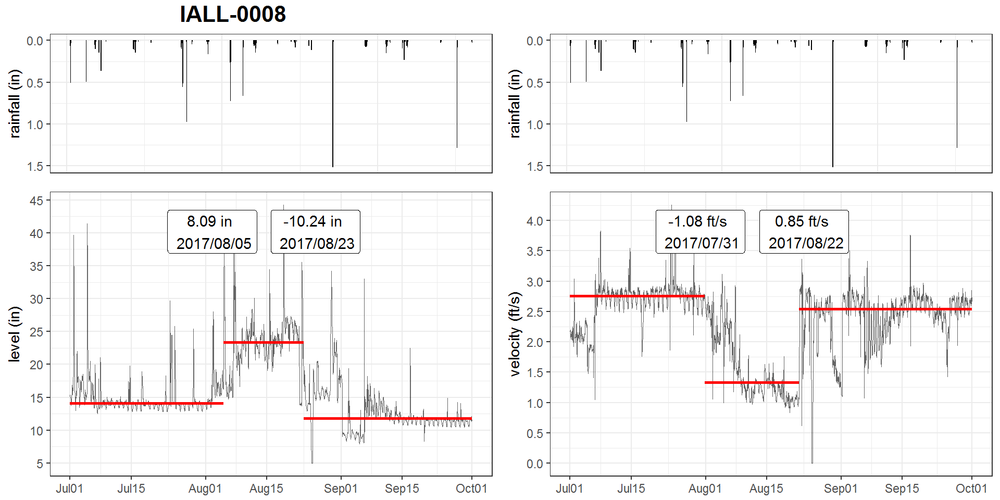

<h3>ABSTRACT</h3>

The Philadelphia water department (PWD) has been actively monitoring flow data at over 400 sites over Philadelphia since the 2000s. Data is collected twice a month through contractors. Due to the high solid content in sewage, flow data at sewer pipes (level, velocity) suffered from breakouts (mean shift, ramp up) over the time due to sensor ragging, pipe clogging, etc. A stringent Quality Control (QC) protocol is conducted before the data can be used for Hydrologic & Hydraulic modeling tasks. As one QC measure, the water level and velocity are examined to detect any potential breakout. 

Since flow data fluctuates with rainfall-runoff events, the breakout detection algorithm must be robust to avoid the interference of runoff responses. Several breakout detection techniques were compared, and the E-Divisive with Medians (EDM) algorithm is adopted in this study. EDM recursively partitions a time series and uses a permutation test to determine change points. The EDM has following advantages: 
1. EDM uses moving median as opposed to the mean, which is robust to the presence of anomalies; 
2. EDM can detect both 'mean shift' (sudden change) and 'ramping' (gradual change) for multiple change points; 
3. EDM takes a non-parametric approach, meaning the model will adapt to the data's underlying distribution, and therefore can detect distribution change;
4. EDM is fast, as it uses interval trees to efficiently approximate the median. 

The analysis is implemented in a program written in R, and the EDM algorithm is implemented via the 'BreakoutDetection' package developed by Twitter engineers. Non-trivial parameters of the EDM model are carefully tuned to best match the expected outcome. This analysis provides an additional assurance to the data quality. Also, field crews (monitoring, Operation & Maintenance, etc.) can quickly respond to the issue once a breakout has been detected. This analysis is also applicable for other monitored data, such as the trunk and outfall levels at drainage system regulators.

### 1  BACKGROUND

The Philadelphia Water Department (PWD) maintains hydrologic and hydraulic models of the combined sewer collection system for planning, management and compliance purposes. PWD relies on these models to evaluate the effectiveness of existing and proposed CSO control measures. Efforts are being made to refine the models and improve their accuracy as the program progresses from planning to implementation phases. Since the 2000s, PWD has been monitoring the sewerage level and velocity at over 400 manholes across the city for various model calibration/validation tasks. Data are measured at 15-minute interval, which are collected bi-weekly by contractor.

Figure 1. Philadelphia Combined Sewer H&H Model and flow monitoring sites

Due to the high solid content in sewage, level and velocity measurements at sewer pipes may suffered from breakouts (mean shift, ramp up) over the time due to sensor ragging, clogging, or pipe surcharging, etc. A stringent Quality Control (QC) protocol is conducted before the data can be used for Hydrologic & Hydraulic modeling tasks. As one QC measure, the water level and velocity data are examined to detect potential breakouts. Since a breakout isn’t always obvious in time-series plots, visually identifing breakouts is not sufficient and efficient. Hence, a statistical approach that can automatically detect breakouts in a time-series is imperative. 

Since flow data at both combined and sanitary sewer pipes has runoff/RDII components, it may interfere the breakout detection. Therefore, the algorithm must be robust against the presence of anomalies.

### 2  OBJECTIVES

Data quality determines the overall model quality. This study aims to develop a workflow for detecting breakouts in flow monitoring data (level and velocity) utilizing a sound statistical techniques. First, Several state-of-art breakout detection methods are compared through literature review and sample test, and the one that met the following requirements is selected:

-   robust against the presence of anomalies

-   able to detect various types of change (mean, variance, distribution)

-   able to detect mulitple breakouts 

-   weak or no assumption on data distribution

-   fast on large datasets, produce reliable results 

Then the algorithm parameters are carefully tuned to optimize the outcome.

Finally, an application is developed in the R statistical programming language for the breakout detection analysis. A quarterly report is also generated by the application, which is automatically updated biweekly when new data becomes available.

### 3  METHODOLOGY
#### 3.1  Change point analysis

In statistics, the 'breakout detection' belongs to the change point analysis, which has been widely researched over the past 50 years in a wide variety of fields (Rodionov 2005), such as finance (Edwards et al 2012), genetics (Chen and Gupta 2011), and signal processing (Basseville 1988). As we've entered the 'Big Data' era, it has gain it's popularity in low latency, high reliability online analytics for cloud data (James, et al. 2016).

A breakout is typically characterized by two steady states and an intermediate transition period. Mathematically, for data z1,…,zn, if a changepoint exists at τ, then z1,…,zτ differ from zτ+1,…,zn in some way. There are many different types of change, such as mean shift, which is a sudden jump in the time series; Ramp up/down, which is a gradual change in the value of the metric from one steady state to another; distribution change, which is a change in the data distribution. 

Change point analysis mainly answers the questions regarding the existence of a change point, the location of the change, and its significance. Depending on the data distribution assumption, a breakout detection algorithm generally falls into two categories: parameteric (assumes that the observed distributions belong to a family of distributions) and non-parametric (do not make assumption on data distribution and density estimation is used instead) (Pohlert 2018). While parametric methods may be more efficient, most time-series doesn't follow a known distribution family, and therefore, non-parametric methods is preferred.  

Based on the application, breakout detection analysis can be classified as either online (the data is continuously feed to the model) or offline (the data are processed in batches). In this study, an offline analytics is performed since the data is acquired biweekly.  

Although Numerous changepoint detection algorithms are available, many of which are limited to the flow monitoring data as they are not robust against anomalies. 

####  3.2  E-divisive with medians (EDM)

EDM is a novel statistical technique that employs energy statistics (E-divisive) to detect divergence of means. Energy statistics compares the distances of means of two random variables contained within a larger time series. The E-divisive method recursively partitions a time series and uses a permutation test to determine change points, but it is computationally intensive. To overcome this, EDM uses interval trees to efficiently approximate the median, and therefore is much faster than E-Divisive.

EDM can detect various types of change, including 'mean shift' (sudden change), 'ramping' (gradual change), and change in distributions. since EDM is non-parametric, it doesn't make any assumption about the distribution of the time-series, instead, it learn the current distribution as a reference. When the distribution suddenly change EDM can detect the variation; In addition, EDM is capable of detecting multiple change points. To be robust against the presence of anomalies, EDM uses the rolling median as a local smoother to the raw data.

A comparison (James, et al. 2016) between EDM and Pruned Exact Linear Time (PELT) method (Killick et al, 2012), a parametric method for change point detection, shows that EDM outperformed the PELT in the majority of data sets. Due to the weaker assumption in EDM, the EDM takes longer to execute than the PELT. However, the EDM has shown a comparable or better efficacy. Overall, EDM is 3.5x faster than PELT.

####  3.3  R packages for breakout detection

Several R packages can perform breakout detection, such as the `changepoint` package implements the PELT and ... method (Killick & Eckley, 2014), the `ecp` package implements the E-divisive and E-agglometric methods (Matteson & James 2012), and the `BreakoutDetection` package implements the EDM method (James, et al. 2016). The package is developed by Twitter engineers and has been used for analyzing network breakouts on a daily basis at Twitter Inc.

The `breakout()` is the detector function, which has several arguments that specify the cost and penalty. The `method` specifies if a single or multiple breakouts is desired, in this study, the value is set to 'multi' for multiple changes. The `min.size` specifies the minimum number of observations between change points. larger value stands for longer distance between breakouts and thus less breakouts. The value generally ranges from 60 to 240, and it should also be subject to the data analyst's experience. Improperly setting the value may result in too many or too few breakouts. The `degree` specifies the degree of the penalization polynomial (for false positive), the value can only be 0, 1, or 2, and larger value tends to detect fewer breakouts. For detecting divergence in mean, degree is set to 2; for detecting arbitrary change in distribution, 0 < degree < 2 may be a better choice (Sz&egrave;kely & Rizzo 2005). The `beta` and `percent` specify the amount of penalization (for false positive). The `beta` generally ranges from 0.00001 to 0.01, where larger value tends to detect less breakouts. The `percent` represents the minimum percent change in the goodness of fit statistic to consider adding an additional change point, which generally ranges from 0.1 to 0.5, and larger value tends to detect less breakouts. Note that when `beta` is specified, `percent` won't be used.

####  3.4  `breakout()` function argument refinement

Arguments in the `breakout()` function significantly affect the outcome, i.e., the count and location of breakouts. To improve the result, the arguments are refined through a series of supervised trials based on 6 independent flow monitoring time-series data. 

The studied time-series is quarterly flow monitoring data, which are downloaded from CentralDB (a PostgreSQL database). For better efficiency, the data are then subsetted by hour. The `method` argument is set to 'multi' as it's desired for this analysis. Default values were set for the other arguments (`min.size`, `degree`, `beta`, `percent`) in the 'input' section. Since the default EDM method only uses the nearest neibourghs for smoothing anomalies, an additional argument `window` is also discussed in this study, which represents the width of window (must be even) for the additional rolling median filter.

The training process is implemented in a R script. For each argument, the value is varied by a sequence of values while keeping the rest constant (default value), and the resulting count of breakouts is plotted against the value of the arugment, which is the 'elbow plot'. The elbow plot demostrates the sensitivity of an argument under a single-varible assumption, and indicate the proper range of the argument, which is helpful for setting value for new scenarios. Based on the results, a new set of default values (scenario) is proposed, and the process is repeated until the desired outcome is met. 

### RESULTS

After a thorough literature review and testing with sample data, the E-Divisive with Medians (EDM) algorithm is adopted in this study.

Based on a series of tests, the breakout() function arguments are set to: 

-   min.size = 240, (240 = 10 days x 24 sample/day =  samples)
-   degree = 1
-   beta = 0.008, determined by elbow plot
-   percent: not used

[show elbow plot examples]

A R markdown document is developed that includes scripts for breakout detection, summarize the results, and plot breakouts with time-series for multiple sites. To improve the performance, parallel computation is utilized.
The output is a quarterly report that includes a summary table of breakouts, and hydrographs for all sites with hyetograph overlaid. The report is automatically updated bi-weekly when data is updated. In the future, it's expected to be updated more frequently when real-time data becomes available. 

A few breakout examples based on real data are shown in Fig.xxx. a) shows an 
positive change in level and a negative change in velocity near August 1, 2017, and it resets to its original values near August 22, 2017.  This is typically caused by pipe surcharging. 

b) shows a sudden downward shift on November 11, 2014. The opposite trend is observed in the level data, but the breakout was not detected somehow.  

c) flushing effect?

limitation:

-   cannot detect breakouts at both ends of the time-series

-   large runoff response may be identified as breakouts

### CONCLUSIONS
 
EDM is proven to be a reliable, effective, and efficient breakouts detection technique for flow monitoring data (level & velocity) with properly tuned parameters. This method is expected to be applicable for other monitiored time-series data, such as outfall levels at CSO regulators.

In this study, A R application that utilizes EDM for breakout detection is developed. This analysis provides a quality control to the modeling data, which would be beneficial for improving the model quality, and quickly respond to field issues. This analysis is also applicable for other monitored data, such as the trunk and outfall levels at drainage system regulators.

### REFERENCE

James, Nicholas A., Arun Kejariwal, and David S. Matteson. "Leveraging cloud data to mitigate user experience from ‘Breaking Bad’: The Twitter Approach." In Big Data (Big Data), 2016 IEEE International Conference on, pp. 3499-3508. IEEE, 2016.

Matteson, David S., and James, Nicholas A. "A nonparametric approach for multiple change point analysis of multivariate data." Journal of the American Statistical Association 109, no. 505 (2014): 334-345.

James, Nicholas A., and David S. Matteson. "ecp: An R package for nonparametric multiple change point analysis of multivariate data." arXiv preprint arXiv:1309.3295 (2013).

Edwards, Robert D., Magee, John, and Bassetti, W.H.C.. "Technical analysis of stock trends". CRC Press, 2012

Jie Chen and Arjun K Gupta. Parametric Statistical Change Point Analysis: With Applications to Genetics, Medicine, and Finance. Springer, 2011.

Mich&egrave;le Basseville. Detecting changes in signals and systemsa survey. Automatica, 24(3):309–326, 1988

Killick, Rebecca, and Idris Eckley. "changepoint: An R package for changepoint analysis." Journal of statistical software 58, no. 3 (2014): 1-19

Rebecca Killick, Paul Fearnhead, and IA Eckley. Optimal detection of changepoints with a linear computational cost. Journal of the American Statistical Association, 107(500):1590–1598, 2012

Rodionov, S. N. "A brief overview of the regime shift detection methods." Large-scale disturbances (regime shifts) and recovery in aquatic ecosystems: challenges for management toward sustainability (2005): 17-24.

Pohlert, Thorsten. "Non-parametric trend tests and change-point detection." CC BY-ND 4 (2018).

G. J.Sz&egrave;kely and M. L. Rizzo. Hierarchical clustering via joint
between-within distances: Extending ward’s minimum variance method.
Journal of classification, 22(2):151–183, 2005.
